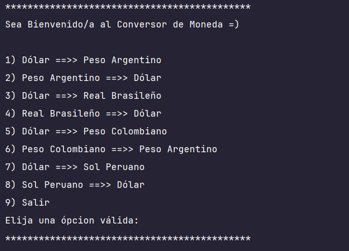
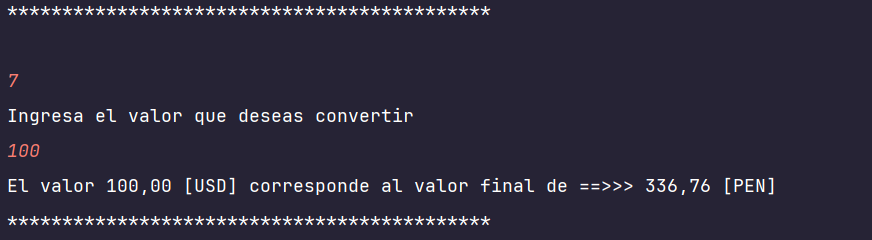

<h1 align="center">💱 CONVERSOR DE MONEDAS 💲</h1>

<p align="center">
  
</p>

<p align="center">
  
  &nbsp;
  
</p>

---

## 📝 Descripción del Proyecto

Aplicación de consola desarrollada en **Java** que permite convertir valores entre distintas monedas utilizando una API externa de tipo Exchange Rate. 
Este desafío forma parte del programa **Oracle Next Education (ONE)**.

---

## 🛠️ Tecnologías utilizadas

- Java 21
- Gson
- API ExchangeRate
- IntelliJ IDEA

---

## 🚀 Funcionalidades

- Conversión entre:
  - USD ↔ ARS
  - USD ↔ BRL
  - USD ↔ COP
  - USD ↔ PEN
- Validación de entradas del usuario
- Consumo de API REST con `HttpClient`
- Manejo de JSON con `Gson`
- Uso de `enum` para monedas

---

## ▶️ Ejecución

Este proyecto requiere una API Key.

1. Crea un archivo `config.properties`:
```properties
exchange.api.key=TU_API_KEY_AQUI
```
2. Ejecuta la clase `Main.java` y sigue las instrucciones en consola

---

## 📷 Capturas del Proyecto


<br>


---

## 👤 Autor

| [<br><sub>Andrio Contreras</sub>](https://github.com/DranxFa) |
| :---: |

---

## 📌 Estado del Proyecto

✅ Finalizado — abierto a mejoras o nuevas versiones.

